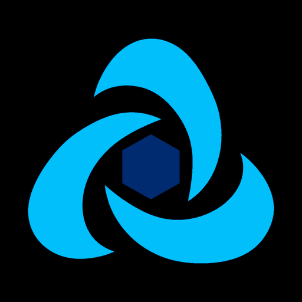

# Mingjun Zhao

**AI Agent Engineer · Security Tooling · Execution Infrastructure**

I build the systems that let AI agents act: reliable tool use, governed execution,
and domain-specific automation that can move from a demo into a real workflow.

[GitHub](https://github.com/iammm0) · [Email](mailto:wisewater5419@gmail.com) · [Damn Agent](https://damnagent.org)

---

## Selected work

<table>
  <tr>
    <td width="50%" valign="top">
      
        
      <strong><a href="https://github.com/iammm0/secbot">SecBot</a></strong>
       
      An authorized security-testing workspace with a NestJS backend, Ink terminal UI, MCP integration, and security-focused tool modules.
        
      <code>TypeScript</code> <code>NestJS</code> <code>MCP</code>
    </td>
    <td width="50%" valign="top">
      
        
      <strong><a href="https://github.com/iammm0/execgo">ExecGo</a></strong>
       
      An agent-first execution layer for validated, cancellable, observable, and recoverable actions, with DAG scheduling and pluggable executors.
        
      <code>Go</code> <code>Runtime</code> <code>Infrastructure</code>
    </td>
  </tr>
  <tr>
    <td width="50%" valign="top">
      
        
      <strong><a href="https://github.com/iammm0/mph-agent">MPH-Agent</a></strong>
       
      A domain-specific agent that turns natural-language COMSOL requirements into complete simulation models across geometry, physics, meshing, studies, and solving.
        
      <code>Python</code> <code>COMSOL</code> <code>Domain Agent</code>
    </td>
    <td width="50%" valign="top">
      
        
      <strong><a href="https://damnagent.org">Damn Agent</a></strong>
       
      A Chinese learning resource for understanding, building, and evaluating AI Agent systems.
        
      <code>Documentation</code> <code>Agent Engineering</code> <code>MDX</code>
    </td>
  </tr>
  <tr>
    <td colspan="2" valign="top">
      
        
      <strong><a href="https://github.com/iammm0">iammm0</a></strong>
       
      My engineering profile: a collection of open-source work across AI Agent systems, security tooling, execution infrastructure, and applied automation.
        
      <code>Open Source</code> <code>AI Agent</code> <code>Engineering Profile</code>
    </td>
  </tr>
</table>

### Other work

- **[execgo-runtime](https://github.com/iammm0/execgo-runtime)** — A process-level data-plane runtime with persistence, cancellation, resource policy, and artifact auditing.

## Engineering focus

| Area | What I care about |
| --- | --- |
| Agent systems | Tool calling, planning loops, context, memory, MCP, and multi-agent coordination |
| Execution | Task contracts, DAG scheduling, retries, timeouts, cancellation, and recovery |
| Safety | Authorization boundaries, sandboxing, resource policy, auditability, and human control |
| Product engineering | Clear interfaces, useful defaults, operational feedback, and documentation that helps people ship |

## Core stack

## Background

I started from applied physics and moved into software engineering through scientific computing, full-stack systems, and increasingly systems-oriented AI Agent work. That background still shapes how I build: define the model, make the constraints explicit, and verify what happens in the real system.

中文简介：我从应用物理出发，逐步进入软件工程，当前专注于 AI Agent、安全工具与执行基础设施。比起展示“会什么”，我更关心系统能否被验证、被控制，并真正完成任务。

## Contact

For collaboration, engineering roles, or open-source work, reach me at [wisewater5419@gmail.com](mailto:wisewater5419@gmail.com) or open an issue in one of the projects above.
